# Rivals Station Reporter

Desktop app for tournament stations running Rivals of Aether II: it watches
the game's stats save + replays, reconstructs each set as it's played, and
reports live scores to your bracket — same stack and look as the
[Rivals 2 Tag Tool](https://github.com/jugeeya/rivals-2-tag-tool)
(Tauri 2 + Vue 3, Rust core).

This is the Rust rewrite of the Python station reporter that lived in
[`jugeeya.github.io/matchlogger/sender/`](https://github.com/jugeeya/jugeeya.github.io/tree/main/matchlogger/sender)
— one installer instead of a Python install, a real UI instead of a Tk
widget. The full design is in `rivals-station-reporter-architecture.md`
(kept alongside this repo).

## What each PC runs

- **Station** — a PC people play on. Watches
  `Rivals2_StatsSaveSlot.sav` + the `Replays` folder (no game mod, no
  injection), rebuilds each game/set, and forwards them to the hub with this
  station's number.
- **Operator** — the TO machine. Runs the LAN hub every station posts to and
  is the only PC that talks to start.gg (the API token never leaves it).
  Gets the all-stations console: live scores stream to the bracket
  automatically, and a set that finishes **unambiguously** reports itself (see
  Auto-report — on by default, and strict about what qualifies). Anything it
  can't be sure of still waits for your click, and anything it got wrong is
  fixable after the fact with `edit result`.
- **Both** — one PC doing both jobs.

The hub speaks the same `/matchlogger/*` HTTP API the old Cloudflare broker
defined (`jugeeya.github.io/broker/worker.js`), and
old Python stations interoperate with a Rust hub (and vice versa) during
migration. Online/ranked ladder games are detected via the save's game mode
and never touch the bracket.

Every screenshot below is sample data, not a live event — the NATIVE app
(Iced), captured by the app itself. `./scripts/screenshots/native.sh`
regenerates all of them (see Development).

## Setup

| [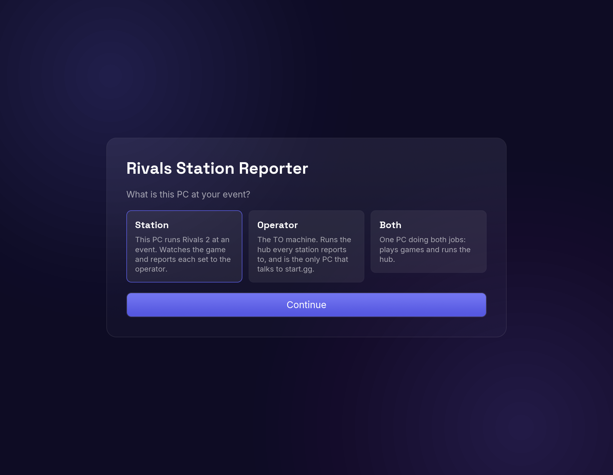](docs/screenshots/onboarding.png) | [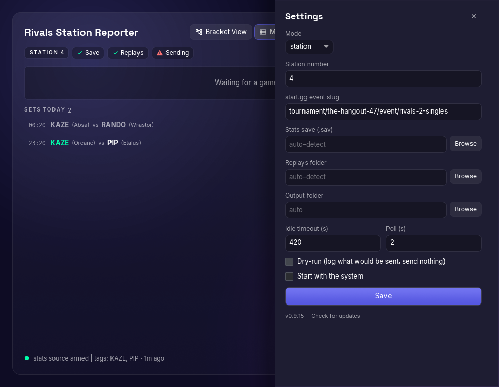](docs/screenshots/settings.png) |
|:--:|:--:|
| **First run** | **Settings**, any time after |
| pick what this PC is | everything else, without restarting |

First run: pick what this PC is; everything else is auto-detected or
validated inline. Settings covers mode, event, hub (found by LAN
auto-discovery), paths, auto-report and the update checker — all editable
while sets are being played.

## The operator screen

| [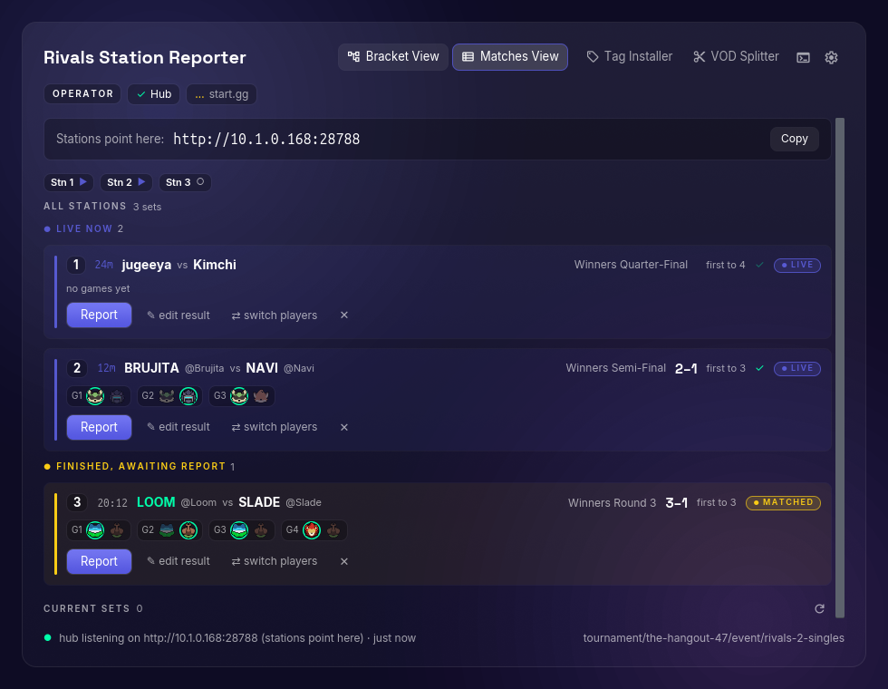](docs/screenshots/operator-console.png) | [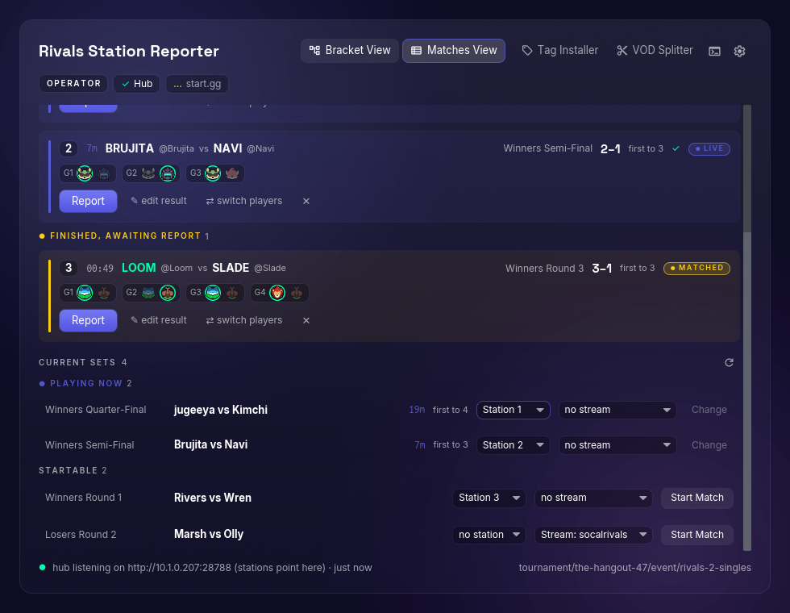](docs/screenshots/available-sets.png) |
|:--:|:--:|
| **The console** | **Current Sets**, below it |
| every station's sets, live and awaiting | what start.gg says is happening now |

The console watches three stations at once: live sets grouped separately from
finished-and-unreported ones, elapsed time and best-of taken from start.gg's
own data when present (station 1 reads 18m and "first to 4" from the bracket,
not the station's local guess), a per-game character strip with each game's
winner ringed, and the tag-to-entrant mapping the hub would actually report,
per player. Station 3's set is finished and awaiting a report — with
auto-report on it would already have gone out; `edit result` corrects a set's
games, characters and score whether or not it has.

Below it, Current Sets shows everything start.gg's bracket has happening
right now, across the whole event. Playing-now and startable sets are grouped
separately, each with its own station AND stream picker (a set can sit at a
station and on a stream at once); for a startable set, picking and clicking
Start Match happens as a single action.

## Bracket

| [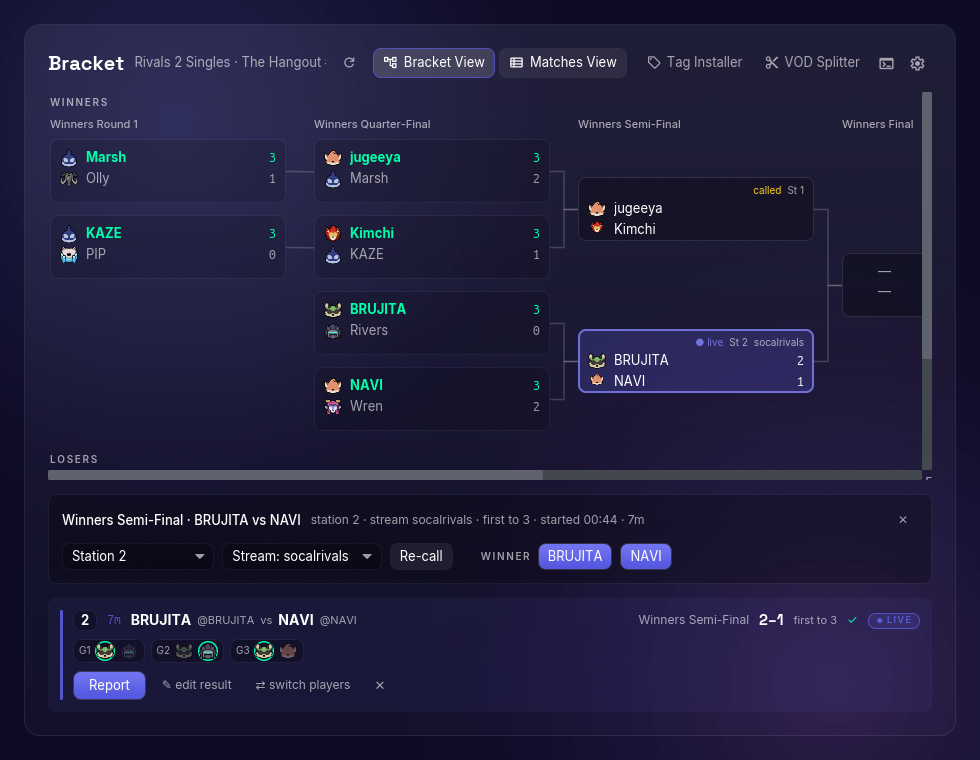](docs/screenshots/bracket.png) | [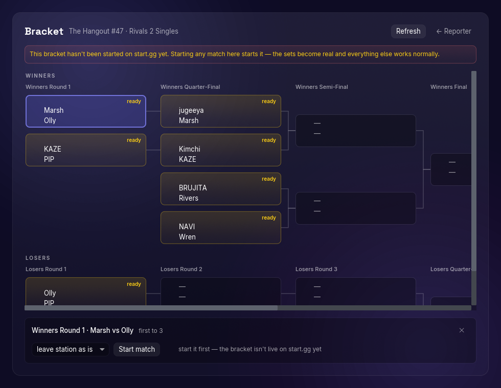](docs/screenshots/bracket-unstarted.png) | [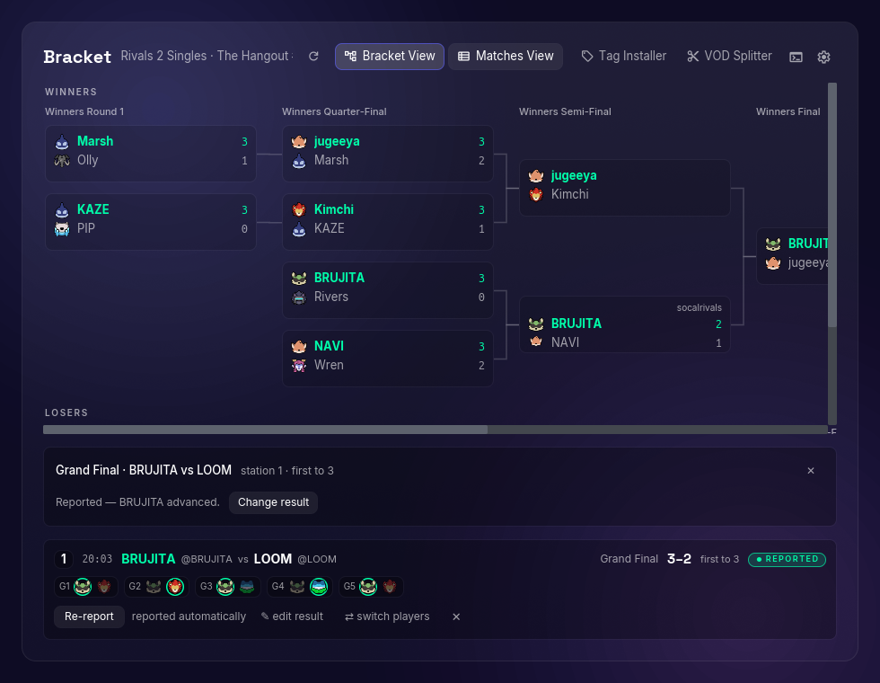](docs/screenshots/bracket-done.png) |
|:--:|:--:|:--:|
| **Mid-event** | **Not started on start.gg** | **Finished** |
| every card state at once | every set still a placeholder | the event as a record |

The event's whole tree, so nobody has to keep start.gg's page open on a
second monitor. Each set sits level with the sets that feed it, with the
lines drawn in, so it reads as a bracket rather than a grid of rounds.

| card | meaning |
|---|---|
| indigo, `● live` | being played right now |
| amber, `ready` | both seats filled, nobody has called it — the set to hand to the next free setup |
| `called` | assigned to a setup, not started yet |
| dimmed | finished; the winner's tag is green and their score bold |
| `—` seats | still waiting on an earlier round |

The station (`St 2`) shows only on sets that haven't finished — on a played
set it's history, on an upcoming one it's where to walk. Selecting a set
opens the bar underneath, offering only what that set can accept:

- **Not called yet, or live:** separate station and stream pickers (a set can
  sit at a station and on a stream at once), Start match / Re-call, and the
  two winner buttons. Both pickers start on where start.gg already has the
  set, so calling it without touching them moves nothing. The stream picker
  hides itself at tournaments with no stream setups.
- **Already reported:** who advanced, plus **Change result** — this is the
  one place in the app that can fix such a set, since the operator console
  can only correct sets one of *its* stations recorded, and by top 8 the
  results worth fixing are usually on sets no station saw. It takes a second
  click on purpose (it resets the set on start.gg first), and says plainly
  that rounds already played out of that set keep their results.

**Before anyone calls the first match**, start.gg holds the sets as
placeholders (middle shot). Starting any one of them materialises the whole
phase — the same thing start.gg's own page does — and the app rebinds to the
real set ids it gets back. Reporting is the one thing that needs the bracket
live first, so the bar offers Start match and says why the winner buttons
aren't there.

Reading the bracket needs **no API token** — it uses start.gg's public
website endpoint, so a station PC can pull the tree up too (its action bar
just says why it's read-only there). Writing does: stations, streams, Start
match (`markSetInProgress`) and reporting all go through the operator's token,
and only ever from an explicit click — the cards themselves carry no write, so
panning around a bracket can't advance anyone.

Reporting from here sends the winner alone, with no per-game data — that's
the difference from the operator console's Report button, which reports a set
a station actually tracked and carries its character data up with it. Prefer
the console for sets your stations covered; use this for everything else
(an untracked setup, a DQ, a set someone played before the reporter was up,
a result that needs changing after the fact).

## A station, over one evening

| [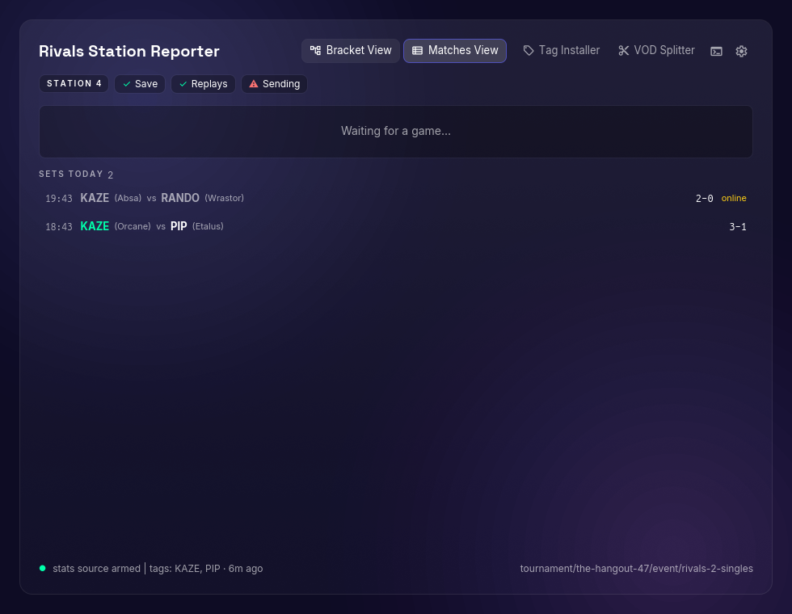](docs/screenshots/station-idle.png) | [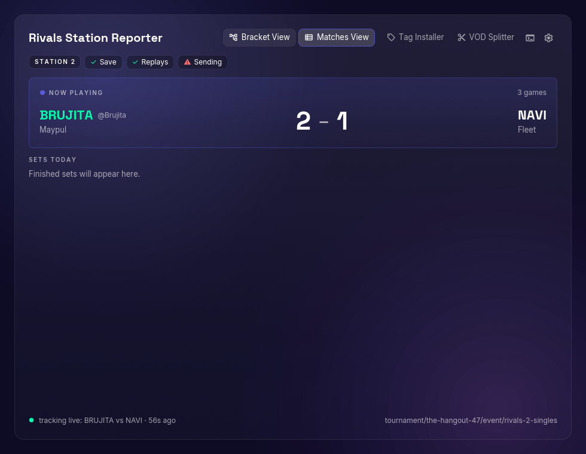](docs/screenshots/station-live.png) | [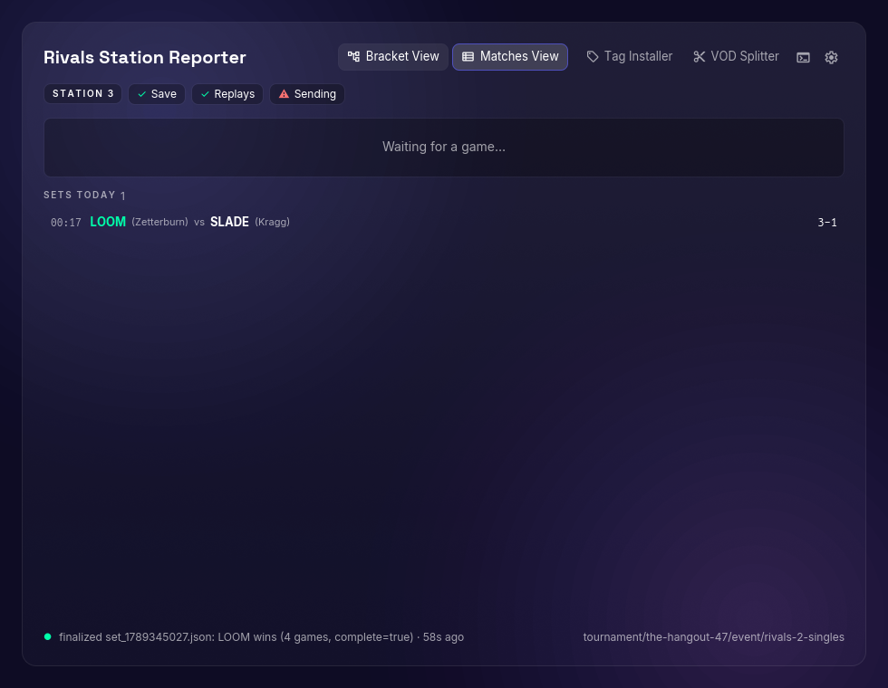](docs/screenshots/station-finished.png) |
|:--:|:--:|:--:|
| **Between sets** | **Mid-set** | **Just finished** |
| health chips, waiting for a game | live score as it's played | the set it just closed out |

A station's whole job is on one screen: health chips up top, the set being
played front and centre, earlier sets below (online ladder games greyed out —
they never reach the bracket). Mid-set it shows the live score, both tags,
current characters and resolved start.gg handles.

The right-hand shot is station 3's LOOM/SLADE set from the operator
screenshot, seen from its own PC. A station only ever knows "this just
finished" — awaiting-report status, and the reporting itself, live on the
operator's hub.

## Auto-report

On by default (Settings, operator only). A set that finishes reports itself
on start.gg within a few seconds, instead of waiting for a Report click.

There is deliberately **no hold-off**. A waiting period only helps if someone
is watching the console at that moment, and it delays every correct result —
the overwhelming majority — to hedge against the rare wrong one. Wrong ones
are fixed after the fact instead (see below).

What still waits for you is anything the hub can't be sure about. A set
reports itself only when **all** of the following hold:

- it finished cleanly (the station's own journal says `complete`, so a set an
  idle timer closed out doesn't count),
- it is bound to a start.gg set (if nobody pressed Start Match on it, the
  report presses it for you — a TO who assigns setups but never calls them is
  normal, and refusing the report just stranded the set),
- it is a local bracket game, not an online or ranked match, and
- the winner's tag matched a bracket entrant **exactly**. A partial match is
  good enough to pre-select for you; it is nowhere near good enough to
  advance a bracket unwatched.

A bracket that hasn't been **started** on start.gg yet is handled too. Its
sets are placeholders there, but starting any one of them from the Bracket
screen (or Current Sets) materialises the whole phase — the same thing
start.gg's own page does when you hit Start Match on an unstarted bracket —
and the app rebinds to the real set ids it gets back. The Bracket screen
notes the state so you know the first Start Match will do it. Reporting is
the one thing that still needs the bracket live first, since a placeholder
set has no id to report against.

Anything short of that behaves exactly as before and waits for a click.
Dry-run disables auto-report entirely. Auto-reported sets are labelled as
such on the row, and the write goes through exactly the same path as the
button — same rebind, same already-reported-elsewhere check immediately
before the write, same per-game character data.

### Correcting a result

The station reads results out of the game's own save data, which is right
almost always and wrong in ways it can't detect: a game the save never
recorded, a mis-read character, a set the idle timer cut short. `edit result`
on any row — **including one that already reported** — opens the games, one
line each with who won and what both players picked, plus add/remove game.
The score, the winner and the game count are all *derived* from those lines,
so they can't end up disagreeing with each other or with what start.gg is
told.

On a set that already went out, the button reads **Save & re-report**:
start.gg won't accept a second result for a completed set, so the correction
resets the set there first and then reports the new one. The reset does not
cascade to dependent sets — fixing one score must not unseed rounds that have
already been played. If your correction changes who *won*, the rounds below
it are wrong too and need fixing on start.gg's own page.

A correction survives the station re-ingesting the set (which has no idea you
changed anything), and a 1–1 correction won't save: a set needs a winner.

## Tag Installer

Before the bracket, pull every entrant's saved tag — name, colors, controls — from
the community tag database
([jugeeya.github.io/tags](https://jugeeya.github.io/tags/)) and install them into this setup's own Rivals 2 save. Paste the bracket URL
and Find: entrants are matched to published tags by their start.gg account
(never by name), matches are selected in one go, and whoever has nothing
published is listed so you know before they walk up. Installs check
save-format compatibility, overwrite same-named tags by default, never touch
slot 0 (the setup owner's tag), and rename to the start.gg tag when two
people share an in-game name so both land. Local `.r2tag` files install the
same way. Every row has a "changes" expander — an Option | Old | New table
(same field list as the website's "View changes") showing exactly what
installing would alter, compared against the same-name tag already in this
save, or against the default settings when it's new here.

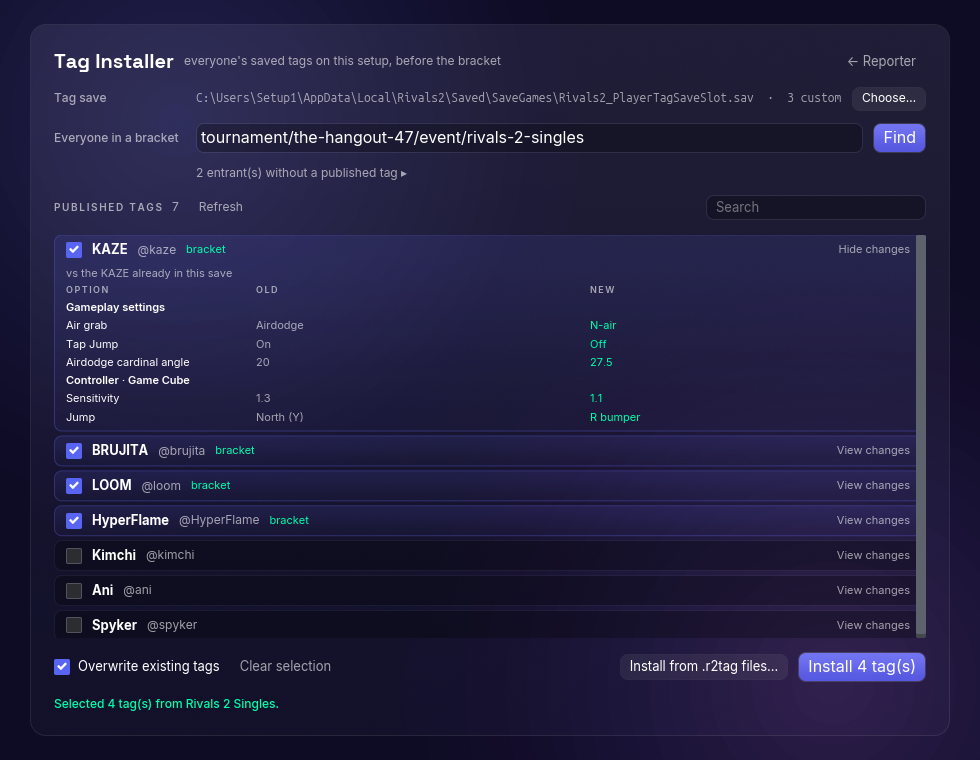

The Tag Installer, before the bracket: one Find against the event URL matched
four entrants' published tags (selected, marked "bracket") and named the two
entrants with nothing published. KAZE's row is expanded to its changes table
— what installing alters versus the KAZE already in this save, per option.
Install writes them into the game's own tag save on this setup — names,
colors, and controls, no in-game retyping.

## VOD Splitter

Point it at a station's full OBS recording after the event and it cuts one clip per set,
named `[Tournament] P1 (Char) vs. P2 (Char) - Round`. It fetches the
bracket's set times from start.gg (no API token needed) and — because it
lives inside the reporter — automatically overlays the station's own
measured set times wherever a set was tracked, so those cuts land where
games actually started and ended instead of on whenever someone clicked
Start Match / Submit. The source is the per-set journals the station writes
as each set finishes (`<out dir>/sets/set_*.json` — written once, never
rewritten, so they survive restarts and later sessions); on the PC that both
played and recorded, they're found automatically. Splitting somewhere else?
Copy that station's `sets` folder over and pick it with "Choose folder…".

Filenames come out like

```
[The Hangout #1] jugeeya (Fleet) vs. Kimchi (Zetterburn) - Winners Quarter-Final.mp4
```

This works very well for single-stream setups and multi-recording setups
alike — it was built for [The Hangout](https://start.gg/thehangout), which
runs 4 recording setups to capture all winners-side and top 8 sets.

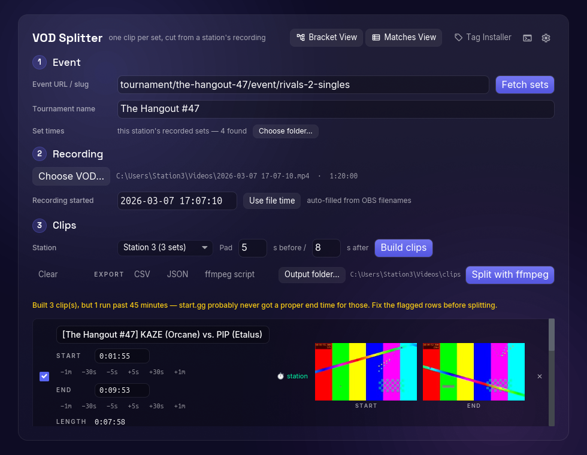

The VOD Splitter, after the event: station 3's recording cut into one clip
per set, with real preview frames at each edge and ±nudge buttons. Sets the
station recorded carry a green ⏱ station mark — their edges come from the
station's own measurements and rarely need touching — while the flagged row
shows the failure mode the warning exists for: start.gg never got a proper
end time, so the clip runs 57 minutes. Split in place with ffmpeg (lossless
stream copy), or export the cut list as CSV (LosslessCut), JSON, or a shell
script.

### What to do during your tournament

The idea is to automate VOD splitting by moving the VOD-marking process to
the ***start.gg match result submission time***. Sets this app's hub tracked
are covered automatically — their start/end times come from the game's own
save data, no discipline required. For everything else (untracked stations,
a stream setup without a reporter), the quality of the cut is the quality of
your start.gg timestamps:

1. **Use start.gg's `Start Match` exactly when you call the match, or as
   close to the true match start as possible.** start.gg stores that start
   time for the splitter to use later. Doing it when you call the match
   leaves some headroom while players get seated, and is much easier than
   watching for the exact game start.
2. **When a match ends, submit results only once you've confirmed:**
   - game count is correct
   - character data is correct
   - station number is correct

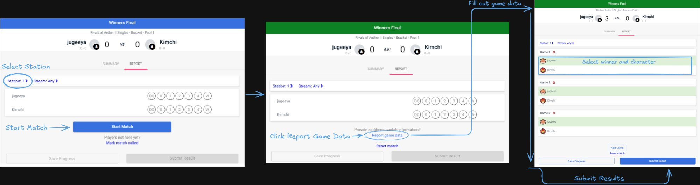

The moment you hit `Submit Results`, start.gg takes that as the set's end
time. If any of the above gets edited *afterwards*, start.gg moves the end
time too — which is how a 10-minute set turns into the `unusually long`
warning. If that happens, you'll just set that clip's end time by hand.

### Recording types

- **OBS recordings** work out of the box. Use OBS's default naming scheme
  (it contains the timestamp), and the "Recording started" field fills
  itself from the filename.
- **Twitch VODs**: [Twitch VOD Downloader](https://chromewebstore.google.com/detail/twitch-vod-downloader/gaabmdjigfcnkgeommfpnoinpdmpfhaj?hl=en)
  gets you a `.chunked.ts` file (its UI also shows the VOD's start time),
  then `ffmpeg -i in.ts -c copy out.mp4` remuxes it into a file this
  program can work with.

### One-time setup: ffmpeg

Splitting in-app (and the preview frames) needs ffmpeg on your PATH. On
Windows, open Terminal and run `winget install ffmpeg`, then restart the
computer so PATH updates take effect.

<details><summary>If that doesn't work, click here for a manual installation method:</summary>

- Go to https://ffmpeg.org/download.html and download the Windows build.
- Extract it to a location like `C:\ffmpeg`.
- Press Win + X → "System" → "Advanced system settings" → "Environment
  Variables". Under "System variables", select "Path" → "Edit" → "New" and
  add the path to the ffmpeg `bin` folder.
- OK out of all dialogs and restart the computer (or your terminal).
- Verify: open a terminal and run `ffmpeg -version`.
</details>

### Splitting workflow

1. Open **VOD Splitter** from the header. The event is prefilled from this
   app's config (any start.gg event URL or slug works), and this station's
   measured set times load automatically from its set journals — the "Set
   times" row shows how many. On the usual setup (the station PC records its
   own gameplay) that's everything, no clicking. Splitting a VOD recorded on
   a different PC? Copy that station's `sets` folder over (it's in the out
   dir: `matchlogger-out/sets/` under the app config dir, e.g.
   `~/.config/io.github.jugeeya.rivals-station-reporter/` on Linux, unless an
   out dir was configured) and point "Choose folder…" at it.
2. Click `Fetch sets`. The tournament display name fills itself if you left
   it blank.
3. Pick your station in the dropdown (e.g. Station 3).
4. `Choose VOD…` and pick the full OBS file.
5. "Recording started" pre-fills from the OBS filename — if it doesn't match
   the filename's hour:minutes:seconds, correct it to match.
6. Click `Build clips`. Station-timed sets carry a green ⏱ mark; those edges
   basically never need touching. If a row is flagged
   **unusually long — check the end time**, find the true end in the VOD and
   type it in (Rivals 2 shows the current time in the top right, and the
   start time is reliable, so start from there). Lengths update as you type.
7. Click `Split with ffmpeg` and choose an output folder — or use
   `Export: CSV / JSON / ffmpeg script` to finish the job in another tool.
   The CSV imports straight into
   [LosslessCut](https://github.com/mifi/lossless-cut).

Cuts are stream copies (no re-encode), so they're fast and lossless, but they
land on the nearest keyframe rather than the exact millisecond. That's what
the preview frames are for — if a clip starts a beat early or late, nudge it
with the ±5s/30s/1m buttons.

## Install

Grab the build from the latest GitHub release: Windows portable `.zip`,
macOS `.app` zip, Linux/SteamOS `.AppImage`. The UI is native (Iced — pure
Rust, no webview), so there is no browser engine to configure on any
platform. First run walks through setup: pick what this PC is, paste the
start.gg event link (it echoes back the tournament name so a wrong paste is
caught immediately) — done. Stations find the operator's hub on the LAN by
themselves. Save/replay paths are auto-detected. Updates: Settings → "Check for
updates" downloads and applies the newest release in place.

On Windows and macOS, closing the window sends the app to the tray and
reporting keeps running ("Start with Windows" is in Settings). On Linux
there is no tray (that would drag the GTK stack back in); closing quits, so
leave the window open — or minimized — while sets are being played.

An existing `config.json` from the Python reporter uses the same keys and can
be pasted into Settings field-by-field (the file lives at the app config dir
once saved).

## Development

```sh
cargo run -p station-app     # the desktop app (native Iced UI)
cargo test -p station-core   # every ported behavior test (matching, stats,
                             # set machine, hub, forwarder, startgg client)
cargo test -p station-app    # engine-layer tests
./scripts/screenshots/native.sh   # regenerate the README screenshots
```

Dev tricks: `RSR_CONFIG_DIR=/tmp/profile` runs against a scratch profile
instead of the real one; `RSR_SCREENSHOT=out.png` renders the app, saves a
screenshot after ~2s, and exits; `RSR_SEED_STATE=seed.json` freezes fixture
data into the UI (`vodSplitter` / `tagInstaller` keys seed those screens);
`RSR_OPEN=settings|log|vod|tags` opens a drawer — or one of the tool
screens — on launch.

All logic lives in `crates/station-core` (no UI dependency) — 1:1 ports of
the Python modules with their tests. `crates/station-app` is the Iced shell:
an engine thread that owns the producer/forwarder/hub and pushes state
snapshots to the UI over one channel.

To check save-parsing parity against a real save:

```sh
RSR_REAL_SAVE="C:/Users/you/AppData/Local/Rivals2/Saved/SaveGames/Rivals2_StatsSaveSlot.sav" \
  cargo test -p station-core parses_real_save
```

## Release

Tag `v*` and push — CI builds the installers and attaches them to a draft
release. Unsigned binaries: Windows SmartScreen will warn on first run
("More info → Run anyway").
